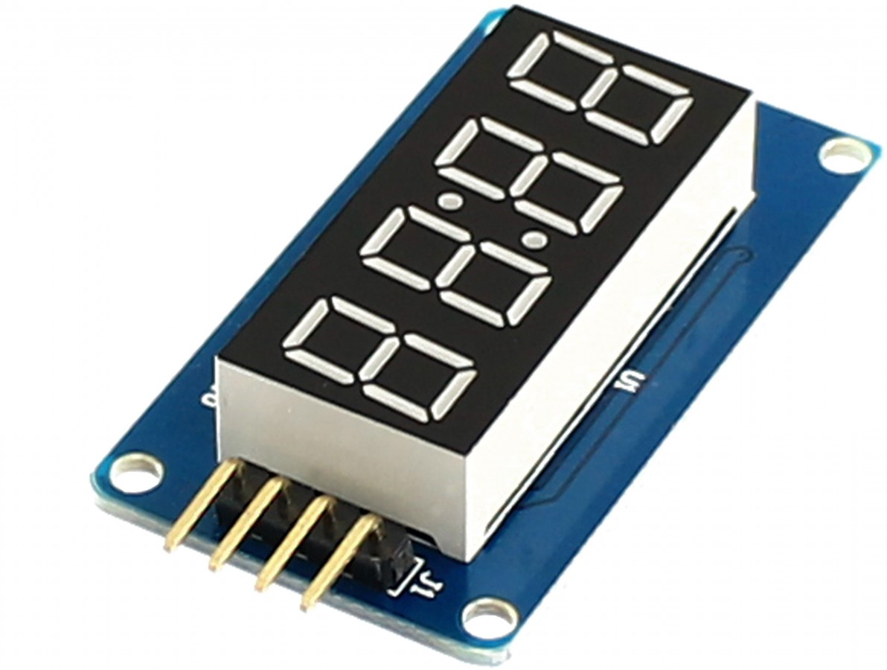

## Exemplo de uso da biblioteca TM1637



## main.h
```
/* Private defines -----------------------------------------------------------*/
#define CLK_Pin GPIO_PIN_10
#define CLK_GPIO_Port GPIOB
#define DATA_Pin GPIO_PIN_11
#define DATA_GPIO_Port GPIOB
```

## main.c
```
/* Private includes ----------------------------------------------------------*/
/* USER CODE BEGIN Includes */
#include "TM1637.h"
/* USER CODE END Includes */

...

/* USER CODE BEGIN 2 */

HAL_Delay(1000);

uint8_t data[4] = {0b00000110, 0b01011011, 0b01001111, 0b01100110};

TM1637_WriteData(0xC0, data, 4);

```